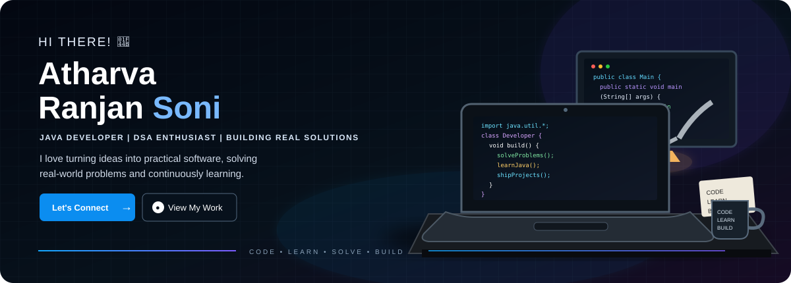

  

  
  
  
  

---

## 👋 About Me

> **B.Tech 3rd Year · Java Developer in Progress · DSA Enthusiast**

I'm building my foundation around **Java, Data Structures & Algorithms, problem solving, and practical software development**. I like taking a real problem, breaking it down, and turning the solution into working software.

| Focus | What I'm doing |
|---|---|
| ☕ Java | Building a strong core and moving toward professional Java development |
| 🧠 DSA | Consistent practice with Java |
| 🛠️ Projects | Building practical, real-world software |
| 🌐 Development | Learning full-stack concepts and product engineering |
| 🎯 Goal | Become a strong Java Developer |

**College:** Shri Ramswaroop Memorial College of Engineering & Management

---

## 🧩 Tech Stack

  

  Java · Python · JavaScript · HTML · CSS · React · Tailwind · Spring Boot · MySQL · Firebase · Node.js · Git · GitHub · VS Code · Figma

---

## 🚀 Featured Projects

<table>
<tr>
<td width="50%" valign="top">

### ♻️ Kabadiwala Connect

**Bringing the informal collector into the formal recycling chain.**

A technology-driven e-waste ecosystem connecting collectors with authorized recyclers, with a focus on **traceability, price discovery, digital lot creation and accessible workflows**.

**Focus:** `Java / Full-Stack` · `AI` · `E-Waste` · `Product Engineering`

<a href="https://github.com/Atharva-001-cyber/Kabadiwala_Connect">→ View Repository</a>

</td>
<td width="50%" valign="top">

### 📧 Email Classifier

An email classification project focused on automatically categorizing incoming messages using **machine-learning based text classification**.

**Focus:** `Python` · `Machine Learning` · `NLP` · `Classification`

<a href="https://github.com/Atharva-001-cyber/Email_Classifier">→ View Repository</a>

</td>
</tr>
</table>

---

## 🧠 DSA Journey

I'm currently putting serious focus into **DSA with Java**.

| Area | Status |
|---|---|
| Arrays | 🟦🟦🟦🟦🟦🟦🟦🟦⬜⬜ In Progress |
| Strings | 🟦🟦🟦🟦🟦🟦🟦⬜⬜⬜ In Progress |
| Linked Lists | 🟦🟦🟦🟦🟦🟦⬜⬜⬜⬜ Building |
| Stacks & Queues | 🟦🟦🟦🟦🟦🟦⬜⬜⬜⬜ Building |
| Sorting | 🟦🟦🟦🟦🟦🟦⬜⬜⬜⬜ Building |
| Trees / Graphs | 🟦🟦🟦⬜⬜⬜⬜⬜⬜⬜ Learning |
| Problem Solving | 🟦🟦🟦🟦🟦🟦🟦⬜⬜⬜ Daily Practice |

> **Consistency compounds.** The goal is not just to solve a problem, but to understand the reasoning behind the solution and write cleaner, more efficient code.

### 🏆 Coding Profiles

- 🟠 **LeetCode:** [Atharva_Soni-20](https://leetcode.com/u/Atharva_Soni-20/)
- 🍳 **CodeChef:** [span_fish_77](https://www.codechef.com/users/span_fish_77)
- 🟣 **Codolio:** [atharva@123](https://codolio.com/profile/atharva@123)

---

## 📊 GitHub Activity

  
  

  

---

## 🌐 Let's Connect

  
  
  
  

---

  <strong>CODE • LEARN • SOLVE • BUILD</strong> 
  <i>Consistency compounds.</i> 🚀

