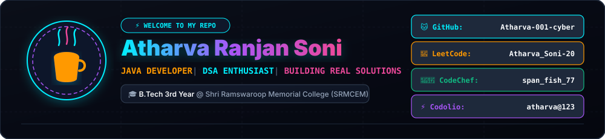
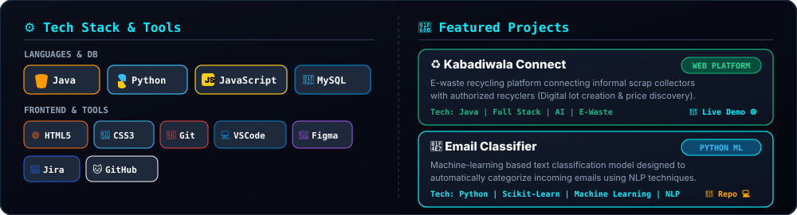
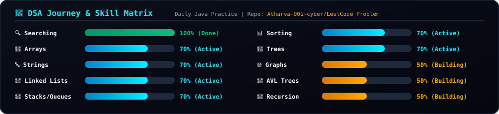
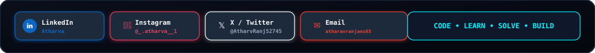

  <!-- Panel 1: Header Cover & Coding Platforms -->
  

 

  <!-- Panel 2: Tech Stack Icons & Featured Projects -->
  

 

  <!-- Panel 3: DSA Journey Topic Matrix -->
  

 

<!-- Live GitHub Stats Row -->

  
  

 

  <!-- Panel 4: Social Connect Buttons & Tagline Footer -->
  

