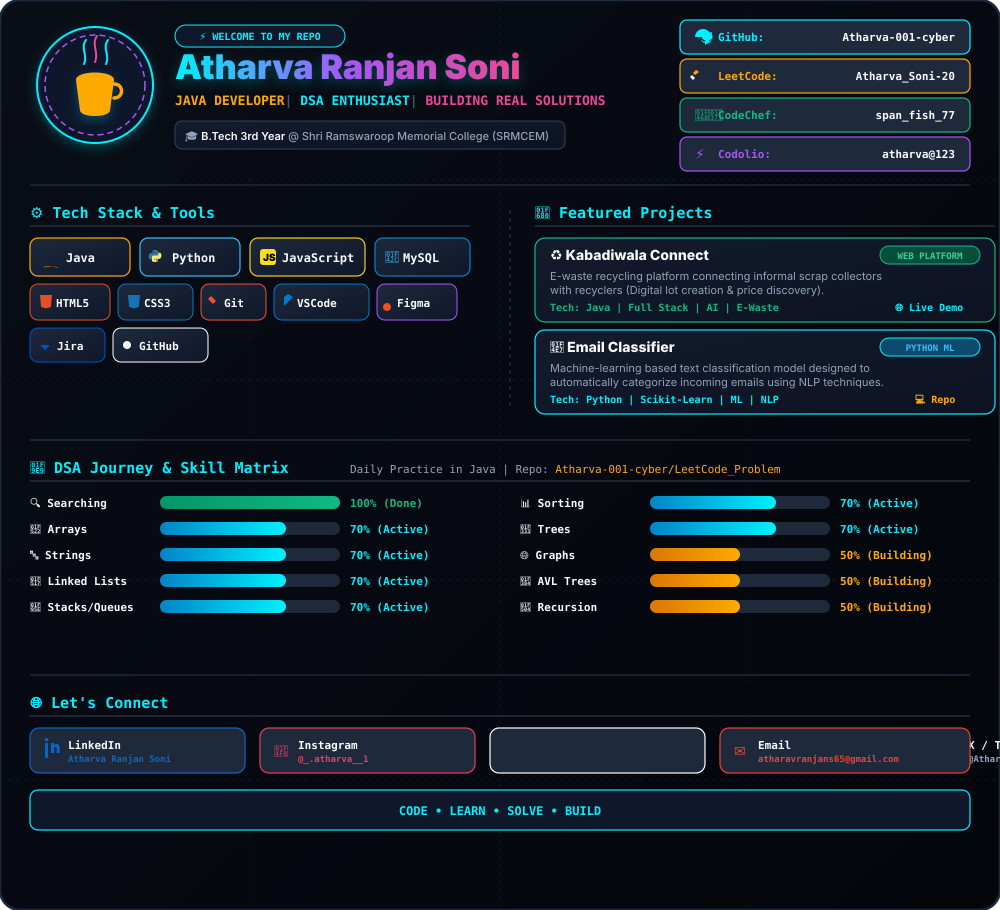

  <!-- Master Dark Cyberpunk Dashboard SVG (Enforces 100% Dark Mode Aesthetic in both Light and Dark themes!) -->
  

 

<h2 align="center">📈 Live GitHub Stats &amp; Activity</h2>

  
  

 

  

 

  

